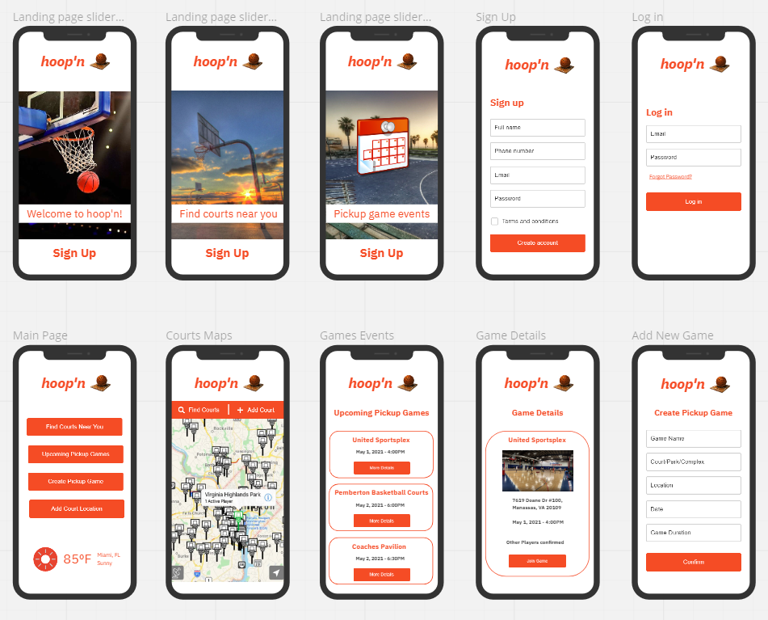
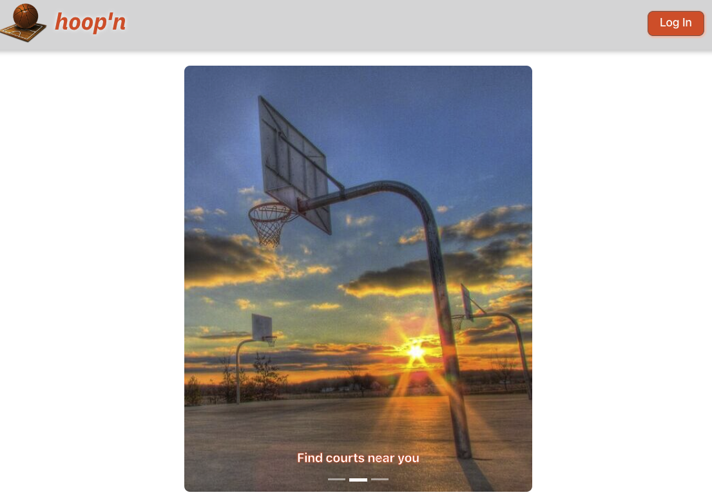
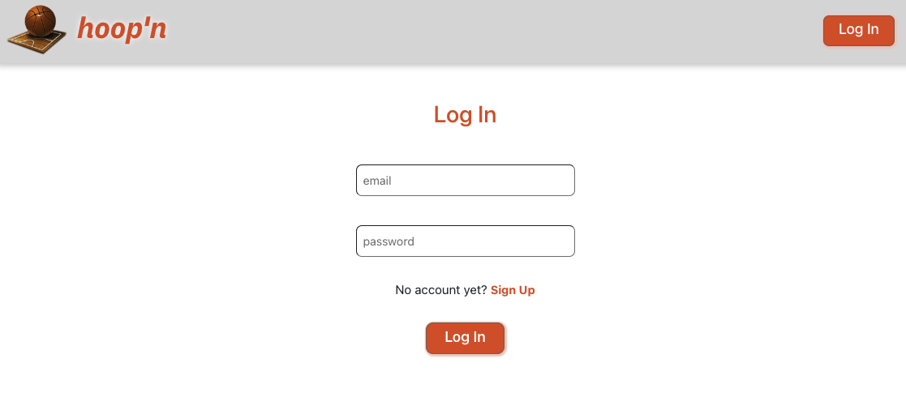
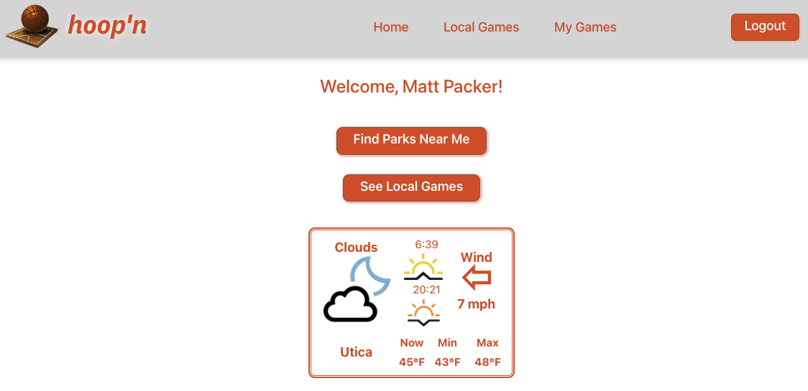
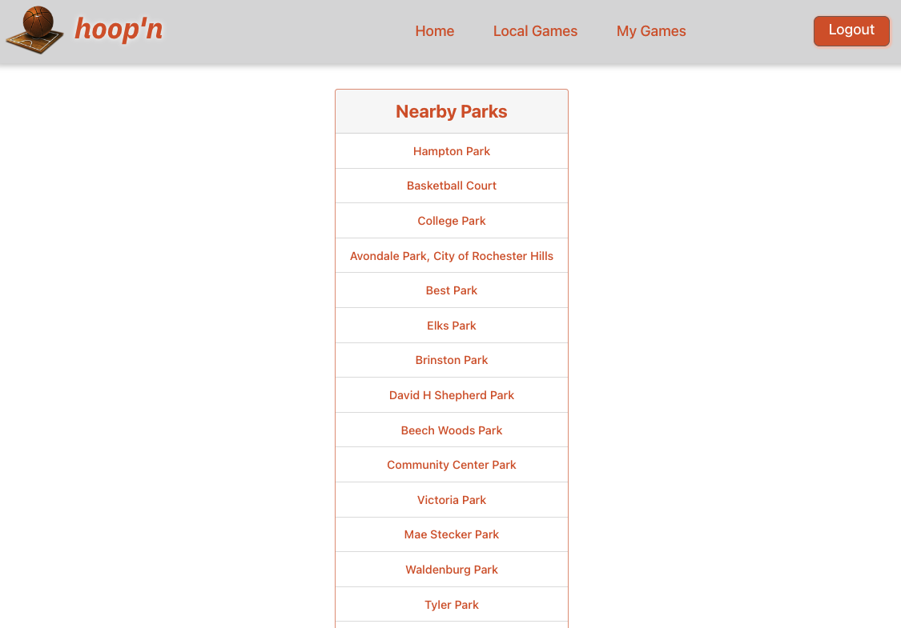
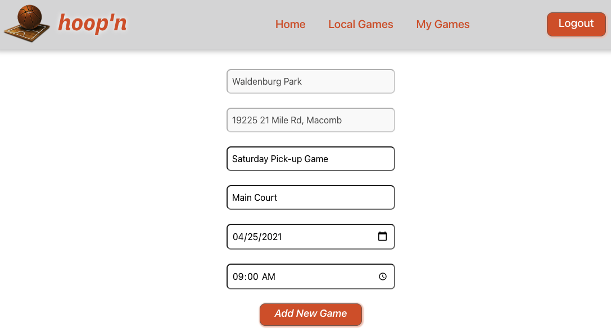
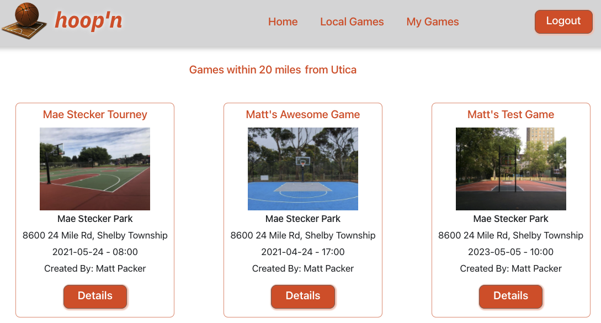
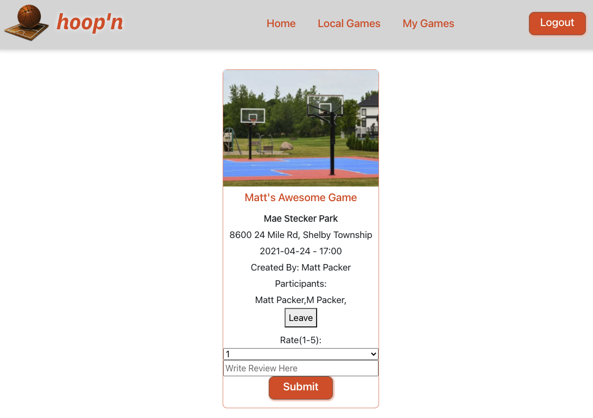

# Hoop'n
#### By Hamid Ebrahimi, David Cibin, Kentdrick Barnes, and Matt Packer  

*Hoop'n* is a full 'MERN' (MongoDB, Express, React, Node) stack application that makes full use of CRUD (Create, Read, Update, Delete) data operations.  

This application was designed to give basketball enthusiasts easier access to pick-up games in their local area. Using the Google Maps Places API, the app allows users to use their geolocation to find pick-up games and parks in their area, and provides real-time weather information from the OpenWeatherMap API.

Users can also create their own events, and leave reviews for events they have participated in. This application was designed using a mobile-first approach and is fully responsive for use on mobile phones or PC/Mac web browsers. 

*Hoop'n* was created during the third unit of [General Assembly](https://www.generalassemb.ly)'s Software Engineering Immersive program. The initial version was planned, developed and deployed over the course of two weeks. It was created from scratch using technologies in the ‘MERN’ stack, including MongoDB, Mongoose, Express, React and Node.

Future enhancements are planned and are outlined below.

### Getting Started:
The app can be launched [here](https://hoop-n.herokuapp.com/) and was deployed using Heroku.

We used Trello to oranize our project throughout development. Our Trello board can be found [here](https://trello.com/b/Ob8kwzWp/unit-3-full-stack-mern-app-hoopn#).

##### Wireframes:

  

### Screenshots:

##### Landing Page:

##### Login Page:

##### Post-Login Main Page:

##### List of Nearby Parks/Courts:

##### Create a New Game Page:

##### Local Games Page:

##### Game Details Page:

### Technologies Used:
* MongoDB
* Express
* Node
* React
* Mongoose
* HTML
* CSS
* JavaScript
* [React Bootstrap](https://react-bootstrap.github.io/)
* [React Transition Group - CSSTransition](http://reactcommunity.org/react-transition-group/css-transition)
* Git
* GitHub
* Heroku

### Additional Tools and Resources:
* [Google Maps-Places API](https://developers.google.com/maps/documentation/places/web-service/overview)
* [Open Weather Map-API](https://openweathermap.org/api) (Free Weather API)
* [Dovora Interactive](https://www.dovora.com/resources/weather-icons/) (Weather Icons)
* [PxHere](https://pxhere.com/) (Free Creative Commons Photos) 
* [Visual Studio Code](https://code.visualstudio.com/) (VS Code)
* [Trello](https://trello.com/en-US) (Project Planning, Organization, and Collaboration Tool)
* [Whimsical](https://whimsical.com/) (Flowchart/Diagram/Wireframing Tool Used for ERD)
* [Miro](https://miro.com) (Whiteboarding/Wireframing Tool)
* [Slack](https://slack.com/) (Collaboration and Communication)
* [Zoom](https://zoom.us) (Communication and Collaboration)

### Special Thanks:
* Thank you to our instructors from General Assembly (Ben Manley, David Stinson, Shahzad Khan) for assistance in troubleshooting our APIs!
* Thank you to Sam Gemberling and William Hunter Long for all the help with React, and with the back-end of our application!
* Thank you to Ben Manley for the assistance with the OpenWeatherMap API, and for the code that allows us to easily display wind direction and sunrise/sunset in our app!
* Our NavBar component was created with the help of [this](https://medium.com/@sidbentifraouine) resource, created by Sid Bentifraouine, contributor on Medium.

### Next Steps (Icebox Features):
* Incorporate Google OAuth authentication to allow users to use their Google account to access the application.
* Incorporate other sports into the application (i.e. soccer, volleyball, softball, tennis, etc.)
* Allow users to set up a "squad" of players that frequently play together on a team.
* Allow users to rank other players and see other player rankings.
* Allow users to 'check-in' for an event when they arrive at a park, and see a list of other users who have checked-in.
* Allow users to chat with each other in real-time.
* Allow users to let other players for a game know whether they will be bringing a basketball.
* Allow users to search for events/parks by zip code.
* Show users actual photos of a park/gym when viewing the location details.

