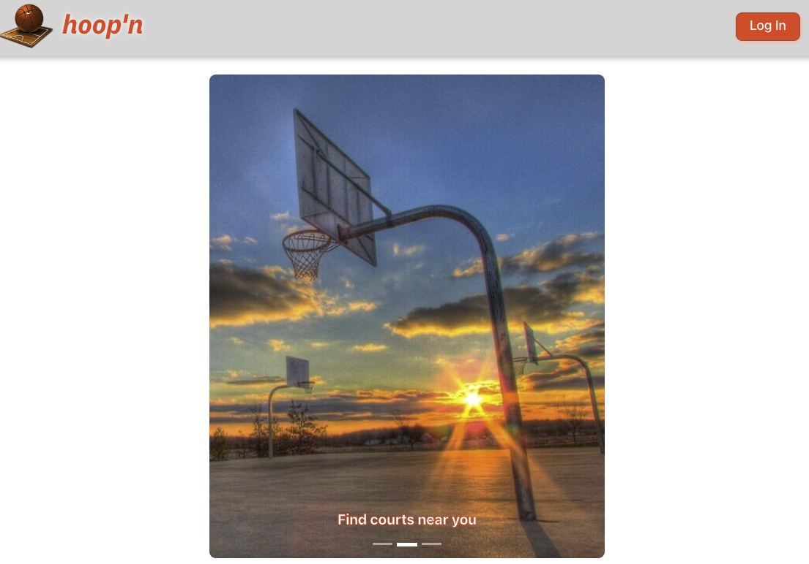

# HoopN

Find a nearby basketball court, organize a pickup game, and see who is playing before you arrive.

HoopN began as a four-person General Assembly capstone in 2021. This repository now documents a deliberate modernization of that early-career project: the product idea and visual history remain recognizable, while the runtime, build system, API boundaries, authentication, deployment path, and automated checks have been rebuilt for a maintainable portfolio baseline.



## What it does

- Discovers nearby basketball courts with the Google Places API
- Shows local weather through OpenWeather
- Lets authenticated players create and manage pickup games
- Supports explicit join and leave actions without exposing arbitrary event updates
- Lets players review games with a validated 1–5 rating
- Restricts event editing and deletion to the organizer

## Architecture

```text
React + Vite client
        │
        ▼
Express 5 API ─────► Google Places / OpenWeather
        │
        ▼
MongoDB + Mongoose
```

The browser only talks to the HoopN API. External API credentials stay on the server, JWTs are accepted through Bearer authorization headers, authentication traffic is rate-limited, and event mutations use narrow action endpoints.

## Stack

- Node.js 22, Express 5, MongoDB, Mongoose 8
- React 19, Vite 8, React Router, React Bootstrap
- Vitest, Testing Library, Supertest, GitHub Actions
- Docker and Fly.io configuration

## Run locally

Requirements: Node.js 22+ and a local or hosted MongoDB database.

```bash
git clone https://github.com/hhuumm/HoopN.git
cd HoopN
npm install
cp .env.example .env
npm run dev
```

On Windows PowerShell, copy the environment template with `Copy-Item .env.example .env`.

The Vite client runs at `http://localhost:3000` and proxies API requests to Express at `http://localhost:3001`.

### Environment variables

| Variable | Purpose | Required |
| --- | --- | --- |
| `DATABASE_URL` | MongoDB connection string | Yes |
| `SECRET` | Long random value used to sign JWTs | Yes |
| `GOOGLE_KEY` | Google Places API key | For court discovery |
| `OPENWEATHER_KEY` | OpenWeather API key | For weather |
| `PORT` | Express port; defaults to `3001` | No |
| `CORS_ORIGIN` | Comma-separated allowed browser origins | No |

Never commit `.env`; only the key-free `.env.example` belongs in source control.

## Verify and deploy

```bash
npm test
npm run build
npm run check
```

For production, `npm run build` creates the static client in `build/`, and `npm start` serves both the API and that client. The included multi-stage Dockerfile builds the same artifact and exposes the configured service port.

## Modernization notes

The current modernization removes invalid Windows metadata filenames from the repository, replaces Create React App with Vite, upgrades the runtime and core dependencies, separates app construction from server startup for testability, fixes the production entrypoint, validates external-service failures, and removes a broken password-reset flow rather than advertising an unsafe incomplete feature.

The next product-focused iteration can concentrate on the interface, accessibility, and court-search experience now that the underlying project is reproducible and testable.

## Project history and credits

The original two-week application was designed and built by Hamid Ebrahimi, David Cibin, Kentdrick Barnes, and Matt Packer during General Assembly's Software Engineering Immersive program. The screenshots in `public/images` preserve that original release. This modernization is intentionally presented as an evolution of collaborative early-career work, not as a newly authored greenfield product.
